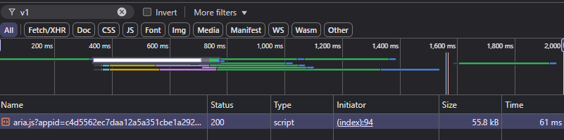

### Cookies required for scraping Sogou
Because no publicly available APIs exist for searching Sogou, This project used hard coded cookies which are required to bypass the anti-bot/spider detection mechanisms in place by Sogou.

In order to add addition cookies to this project, in case you are getting blocked or just want to add more variety follow these steps.

1. Navigate to https://weixin.sogou.com/ in a browser of your choice.

2. Open up developer tools and navigate to the network tab.

3. Do a hard refresh of the site (shortcut CTRL + SHIFT + R can be used for this). There should be at least one packet that shows up in the developer tools.

    

4. Copy the raw request header from that packet into a new element in the `HEADERS_PROFILES` list located in the `scraper.py` file