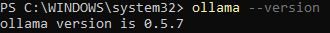

# Set up

To download and run this tool, follow these steps:

### Download Postgres

This section provides instructions for downloading and installing PostgreSQL on your machine.

For Windows:
1. Visit the official PostgreSQL download page for [Windows](https://www.postgresql.org/download/windows/)
2. Click on the "Download the installer" link to download the PostgreSQL installer.
3. Run the downloaded installer and follow the on-screen instructions to complete the installation.
4. During the installation process, you will be prompted to set a password for the PostgreSQL superuser (postgres). Make sure to remember this password as you will need it later.
5. Once the installation is complete, you can verify the installation by opening the SQL Shell (psql) and connecting to the PostgreSQL server using the superuser credentials.

For Linux (Ubuntu):
1. Visit the official PostgreSQL download page for [Linux](https://www.postgresql.org/download/linux/ubuntu/)
2. Follow the instructions on the page to add the PostgreSQL APT repository to your system.
3. Update the package lists on your system by running the command: `sudo apt-get update`.
4. Install PostgreSQL by running the command: `sudo apt-get install postgresql postgresql-contrib`.
5. After the installation is complete, you can verify the installation by switching to the postgres user and accessing the PostgreSQL prompt using the commands:
    ```
    sudo -i -u postgres
    psql
    ```
6. You can exit the PostgreSQL prompt by typing `\q` and pressing Enter.

### Clone the repository:

Next we will need to clone the repository from github so that we can use it on our local machine.

```shell
git clone https://github.com/Mean-Greens/Tool.git
cd Tool
```

### Install the requirements:

Navigate to the LangFlask directory and install the required packages. For this consider using a [python virtual environment](https://packaging.python.org/en/latest/guides/installing-using-pip-and-virtual-environments/) so that packages on your system do not conflict with the packages that are needed to run this tool.

Note: Before installing requirements.txt if you are using Windows, for this project you need Python >= 3.13 and Microsoft Visual C++ 14.0 or greater is required on Windows machines. Get it with [Microsoft C++ Build Tools](https://visualstudio.microsoft.com/visual-cpp-build-tools/). You will also need to keep uvloop commented out in the requirements.txt file. It is not compatible with Windows, however, it is compatible with Linux and MacOS.

For any operating system, once the requirements are installed, you will need to `pip uninstall numpy`, and then `pip install numpy` to get a version greater than numpy 2.0. You may get error messages of incompatibility with langchain-chroma, but it works and numpy > 2.0 is required for other dependencies.


```shell
cd ./LangFlask
pip install -r requirements.txt
```

### Install Ollama

Before we can start our application we need to set up [Ollama](https://ollama.com/download?ref=langchain.ca). Ollama is a tool that is used to run open source LLM's locally. After downloading Ollama for your system we are ready to get our LLM. In either terminal or powershell (for windows) type in `ollama --version` to verify that ollama is installed. It should say something similar to:



We the need to pull down the image(s) that we need to run. The first one is a small model that is used for vector embeddings in the datastore.

```shell
ollama pull mxbai-embed-large
```

The next one has options. If you are working on a laptop, or computer with lower specs we suggest you use `gemma2`, however if your computer has higher specs and can handle it, `aya-expanse:32b` is more accurate with its analysis. The two commands are listed below to pull each model depending on your needs.

```shell
ollama pull aya-expanse:32b
```

or

```shell
ollama pull gemma2:9b
```

# Run the Scraper:

Navigate to the LangFlask directory and run the Demo.py file:

```shell
cd ./LangFlask
python Demo.py
```

# Run the Flask application:

Navigate to the Front End directory and run the Flask app:

```shell
cd ./Front\ End
python app.py
```


The Flask application should now be running and accessible at http://localhost:12345.